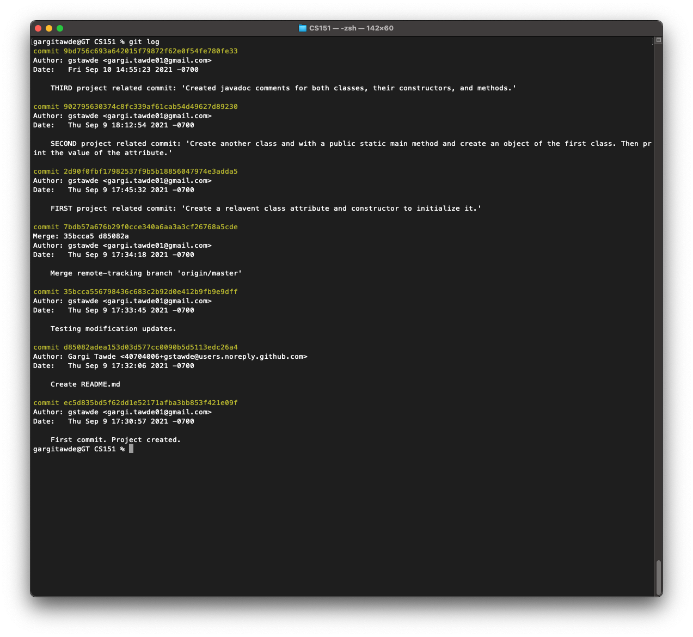

# CS151 Homework Assignment 1

### Summary
*The purpose of this exercise is to practice using git from command line and upload your code on GitHub.*

### Project Expectations
1. **First Commit**: Create a Java class with at least one attribute and constructor that initializes said attribute. Make the first commit with a relavent message. 
2. **Second Commit**: Create another Java class that has a main() method. Inside, create an object of the first class you made. Print the value of instance variable of that object. Make the second commit with a meaningful message.
3. **Third Commit**: Create javadoc comments for both classes, the constructors, methods, and parameters. Make the third commit with a meaningful message.
4. On the command line, call git log which should show all the commits that you made so far. Take a screenshot of your git log call and its yielded result. *(Screenshot below)*

### Extra Credit
- [ ] Create .gitignore
